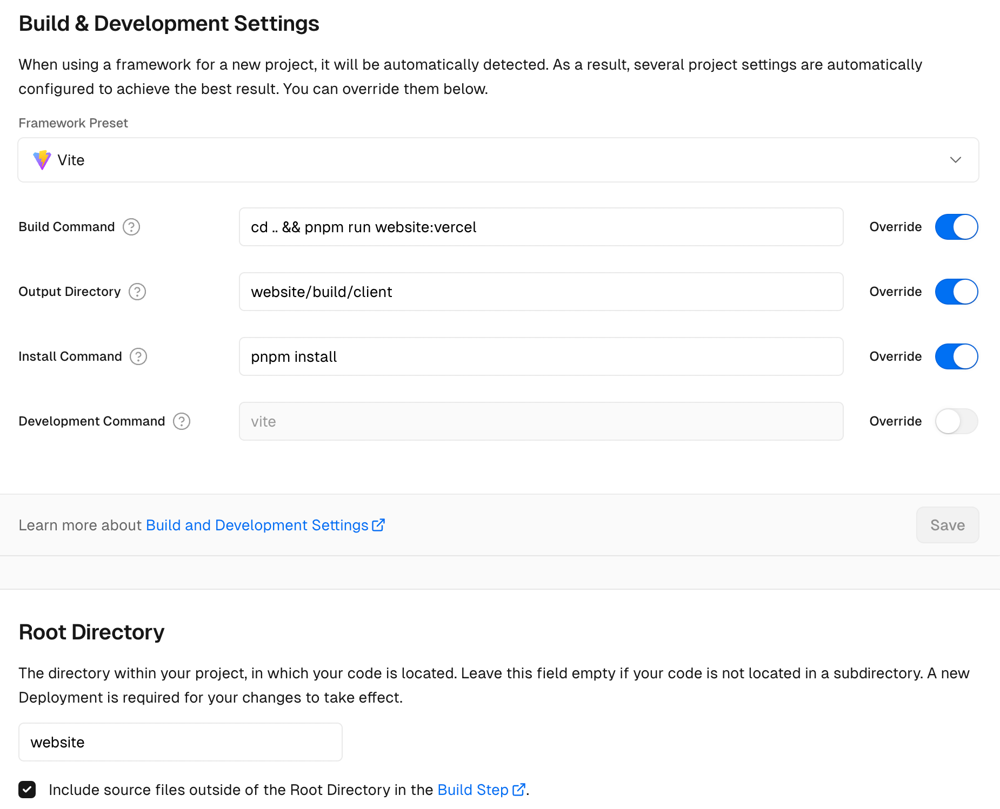

# @resolid/remix-plugins

[简体中文](README.zh_CN.md)

Resolid Remix extension package, mainly some plug-ins to enhance Remix and needs to be used with Vite

## Feature

- [Routing enhancement](#routing-enhancement)
- [Node.js Hono Adapter](#nodejs-hono-adapter)
- [Vercel Serverless Adapter](#vercel-serverless-adapter)

## Install

```bash
pnpm add -D @resolid/remix-plugins
```

### Routing enhancement

Remix uses flat file routing by default, using `.` to split URLs. This method is fine for small projects, but it is not comfortable once it encounters large projects, so I developed a routing system that mixes directories and files.

#### Configuration

Edit `vite.config.ts` file

```ts
import { vitePlugin as remix } from "@remix-run/dev";
import remixFlexRoutes from "@resolid/remix-plugins/flex-routes";

export default {
  plugins: [
    remix({
      ignoredRouteFiles: ["**/*"],
      routes: async () => {
        return await remixFlexRoutes({
          ignoredRouteFiles: ["**/.*"],
        });
      },
    }),
  ],
};
```

#### Router Rules

- Routes are defined and nested using folders, very similar to how HTML files are laid out on the nginx server
- The `_layout` file wraps all downstream routes, which require an `<Outlet />` to render sub-routes
- The `_index` file is the default file for the folder, for example: `/users/_index.tsx` will match `/users`
- Variables are represented by `$` in the file path, for example: `/users/$id/edit.tsx` will match `/users/123/edit`
- Enclosing a route segment in parentheses will make the segment optional, for example: `/($lang)/categories.tsx` will match `/categories`, `/zh/categories`
- You can use `[]` to escape special characters in routing conventions, for example: `/make-[$$$]-fast-online.tsx` will match `/make-$$$-fast-online`
- Files and folders prefixed with `_` become invisible, allowing folder organization without affecting routing paths, for example: `/_legal-pages/privacy-policy.tsx` will match `/ privacy-policy`
- `$.tsx` splash route will match the rest of the URL, including slashes, e.g. `/files/$.tsx` will match `/files`, `/files/one`, `/files/one/two `

> Most of the routing rules are compatible with Remix's routing, but the folder structure is added

## Adapter

Adapters are all run based on [hono](https://hono.dev/) middleware. The default remixHandler is:

```js
import { createRequestHandler } from "@remix-run/server-runtime";

export default function remixHandler(build, c) {
  const requestHandler = createRequestHandler(build, "production");

  return requestHandler(c.req.raw);
}
```

You can create a new `remix.handler.ts` or `remix.handler.js` file in the Remix App directory to change the default handler behavior, such as adding an IP address to the Remix loadContext

```ts
import { createRequestHandler, type ServerBuild } from "@remix-run/server-runtime";
import type { Context } from "hono";

export default function remixHandler(build: ServerBuild, c: Context) {
  const requestHandler = createRequestHandler(build, "production");

  const remoteAddress = c.req.header("x-vercel-deployment-url")
    ? c.req.header("x-forwarded-for")
    : c.env.incoming.socket.remoteAddress;

  return requestHandler(c.req.raw, {
    remoteAddress: remoteAddress,
  });
}
```

### Node.js Hono Adapter

Package the Remix application into a single server file running on hono, which can be run autonomously on VPS using pm2

#### Need to install related dependencies first

```bash
pnpm add hono @hono/node-server
```

#### Configuration

Modify the `vite.config.ts` file

```ts
import nodeHonoBuild from "@resolid/remix-plugins/node-hono";

export default {
  plugins: [
    nodeHonoBuild({
      // Remix App directory, the default is app which is the same as Remix
      appDir: "app",
    }),
  ],
};
```

> After running build, `server.mjs` and `package.json` files will be automatically generated in the `build/server` directory. The `package.json` file defines the `ssr.external` set by Vite in the server directory. Run `npm install` to install dependencies excluded during build

### Vercel Serverless Adapter

#### Need to install related dependencies first

```bash
pnpm add hono @hono/node-server
```

#### Configuration

Edit the `vite.config.ts` file

```ts
import vercelServerlessBuild from "@resolid/remix-plugins/vercel-serverless";

export default {
  plugins: [
    vercelServerlessBuild({
      // Remix App directory, the default is app which is the same as Remix
      appDir: "app",
      // Deployment area
      regions: "sin1",
      // Whether to use clean URL
      cleanUrls: true,
      // The files in the public directory that need to be cached will be cached for one day. By default, favicon.ico will be cached.
      cacheFiles: ["favicon.svg", "apple-touch-icon.png", "manifest.webmanifest"],
      // The folders in the public directory that need to be cached are cached for one year. By default, assets will be cached.
      cacheFolders: ["icons", "images"],
      // Vercel routing, Remix's Server Bundles feature is built in parallel, so the plug-in cannot correctly write the config file routing to Vercel's config file
      // You need to define the route yourself, path is the path of the route, dest is the function name of serverless, the rule is to add an underscore before serverBundleId
      serverRoutes: [
        { path: "admin", dest: "_admin" },
        { path: "", dest: "_site" },
      ],
    }),
  ],
};
```

> Vercel project Framework Preset needs to be set to Vite, Node.js Version needs to be set to 20.x
>
> If you are using a monorepo structure, please set the Root Directory to the project directory that needs to be deployed, and then customize the relevant commands. The configuration of [Resolid](https://github.com/huijiewei/resolid) is as shown below
> 

## Acknowledgment

- [@remix-galaxy/remix-hono-vite](https://github.com/rphlmr/remix-galaxy)
